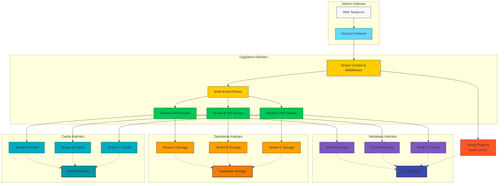

```mermaid
flowchart TD
    subgraph "İstemci Katmanı"
        A[Web Tarayıcısı] --> B[Next.js Frontend]
    end

    subgraph "Uygulama Katmanı"
        B --> C[Tenant Context & Middleware]
        C --> D[Multi-tenant Router]
        D --> E1[Tenant A API Routes]
        D --> E2[Tenant B API Routes]
        D --> E3[Tenant C API Routes]
    end

    subgraph "Veritabanı Katmanı"
        E1 --> F1[Tenant A Şema]
        E2 --> F2[Tenant B Şema]
        E3 --> F3[Tenant C Şema]

        F1 -.-> G[PostgreSQL]
        F2 -.-> G
        F3 -.-> G
    end

    H[Tenant Registry \n public şema] -.-> G
    C --> H

    subgraph "Depolama Katmanı"
        E1 --> I1[Tenant A Storage]
        E2 --> I2[Tenant B Storage]
        E3 --> I3[Tenant C Storage]

        I1 -.-> J[Supabase Storage]
        I2 -.-> J
        I3 -.-> J
    end

    subgraph "Cache Katmanı"
        E1 --> K1[Tenant A Cache]
        E2 --> K2[Tenant B Cache]
        E3 --> K3[Tenant C Cache]

        K1 -.-> L[Redis/Upstash]
        K2 -.-> L
        K3 -.-> L
    end

    style A fill:#f9f9f9,stroke:#333,stroke-width:1px
    style B fill:#61dafb,stroke:#333,stroke-width:1px
    style C fill:#ffcc00,stroke:#333,stroke-width:1px
    style D fill:#ffcc00,stroke:#333,stroke-width:1px
    style E1 fill:#00c853,stroke:#333,stroke-width:1px
    style E2 fill:#00c853,stroke:#333,stroke-width:1px
    style E3 fill:#00c853,stroke:#333,stroke-width:1px
    style F1 fill:#7e57c2,stroke:#333,stroke-width:1px
    style F2 fill:#7e57c2,stroke:#333,stroke-width:1px
    style F3 fill:#7e57c2,stroke:#333,stroke-width:1px
    style G fill:#3949ab,stroke:#333,stroke-width:2px
    style H fill:#ff5722,stroke:#333,stroke-width:1px
    style I1 fill:#ffa000,stroke:#333,stroke-width:1px
    style I2 fill:#ffa000,stroke:#333,stroke-width:1px
    style I3 fill:#ffa000,stroke:#333,stroke-width:1px
    style J fill:#f57c00,stroke:#333,stroke-width:2px
    style K1 fill:#00acc1,stroke:#333,stroke-width:1px
    style K2 fill:#00acc1,stroke:#333,stroke-width:1px
    style K3 fill:#00acc1,stroke:#333,stroke-width:1px
    style L fill:#0097a7,stroke:#333,stroke-width:2px
```
