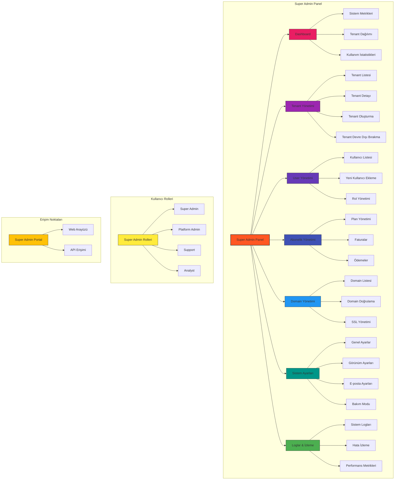

```mermaid
flowchart TD
    subgraph "Super Admin Panel"
        A[Super Admin Panel]
        
        A --> B[Dashboard]
        A --> C[Tenant Yönetimi]
        A --> D[User Yönetimi]
        A --> E[Abonelik Yönetimi]
        A --> F[Domain Yönetimi]
        A --> G[Sistem Ayarları]
        A --> H[Loglar & İzleme]
        
        B --> B1[Sistem Metrikleri]
        B --> B2[Tenant Dağılımı]
        B --> B3[Kullanım İstatistikleri]
        
        C --> C1[Tenant Listesi]
        C --> C2[Tenant Detayı]
        C --> C3[Tenant Oluşturma]
        C --> C4[Tenant Devre Dışı Bırakma]
        
        D --> D1[Kullanıcı Listesi]
        D --> D2[Yeni Kullanıcı Ekleme]
        D --> D3[Rol Yönetimi]
        
        E --> E1[Plan Yönetimi]
        E --> E2[Faturalar]
        E --> E3[Ödemeler]
        
        F --> F1[Domain Listesi]
        F --> F2[Domain Doğrulama]
        F --> F3[SSL Yönetimi]
        
        G --> G1[Genel Ayarlar]
        G --> G2[Görünüm Ayarları]
        G --> G3[E-posta Ayarları]
        G --> G4[Bakım Modu]
        
        H --> H1[Sistem Logları]
        H --> H2[Hata İzleme]
        H --> H3[Performans Metrikleri]
    end
    
    subgraph "Kullanıcı Rolleri"
        I[Super Admin Rolleri]
        
        I --> I1[Super Admin]
        I --> I2[Platform Admin]
        I --> I3[Support]
        I --> I4[Analyst]
    end
    
    subgraph "Erişim Noktaları"
        J[Super Admin Portal]
        
        J --> J1[Web Arayüzü]
        J --> J2[API Erişimi]
    end
    
    style A fill:#ff5722,stroke:#333,stroke-width:2px
    style B fill:#e91e63,stroke:#333,stroke-width:1px
    style C fill:#9c27b0,stroke:#333,stroke-width:1px
    style D fill:#673ab7,stroke:#333,stroke-width:1px
    style E fill:#3f51b5,stroke:#333,stroke-width:1px
    style F fill:#2196f3,stroke:#333,stroke-width:1px
    style G fill:#009688,stroke:#333,stroke-width:1px
    style H fill:#4caf50,stroke:#333,stroke-width:1px
    style I fill:#ffeb3b,stroke:#333,stroke-width:1px
    style J fill:#ffc107,stroke:#333,stroke-width:1px
``` 