# Süper Admin Kullanıcı Akışları

Bu doküman, süper admin kullanıcılarının temel işlem akışlarını detaylandırır.

## 1. Tenant Yönetimi Akışları

### 1.1. Yeni Tenant Oluşturma

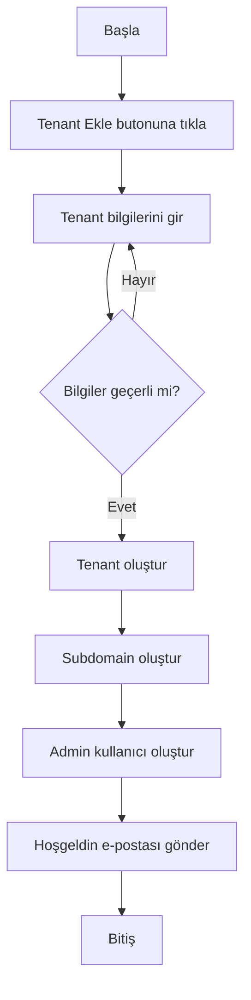

**Detaylar:**
1. Tenant adı ve subdomain kontrolü
2. Plan seçimi
3. Admin kullanıcı bilgileri
4. Özel yapılandırma seçenekleri

### 1.2. Tenant Durumu Değiştirme

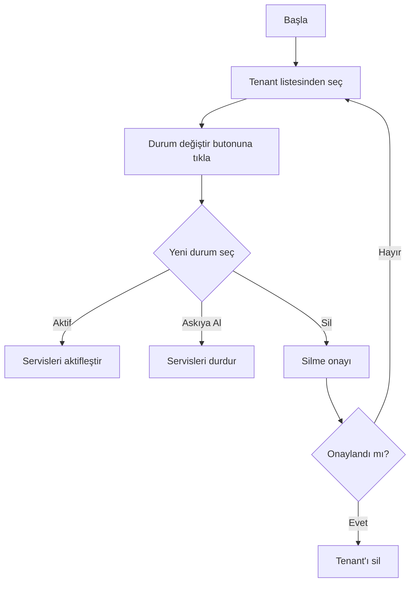

## 2. Domain Yönetimi Akışları

### 2.1. Özel Domain Ekleme

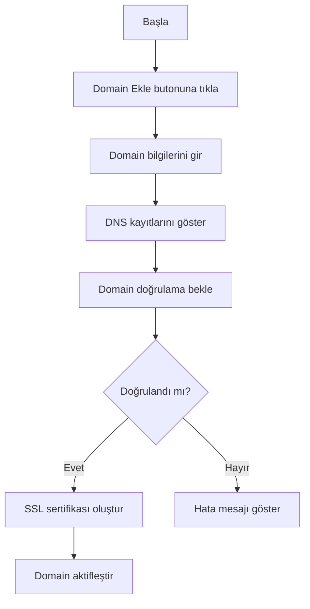

### 2.2. SSL Sertifika Yenileme

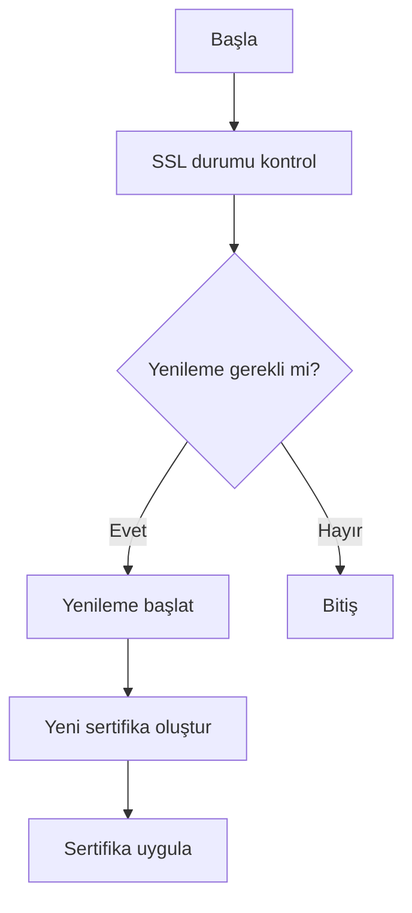

## 3. Güvenlik Yönetimi Akışları

### 3.1. Güvenlik Olayı İnceleme

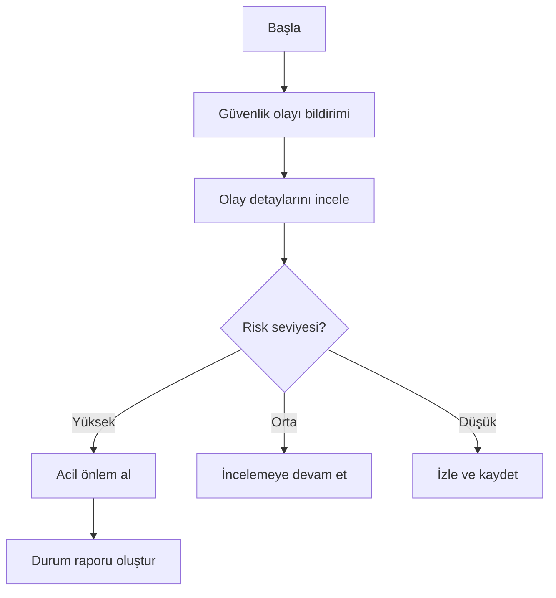

### 3.2. Erişim Kontrolü Yönetimi

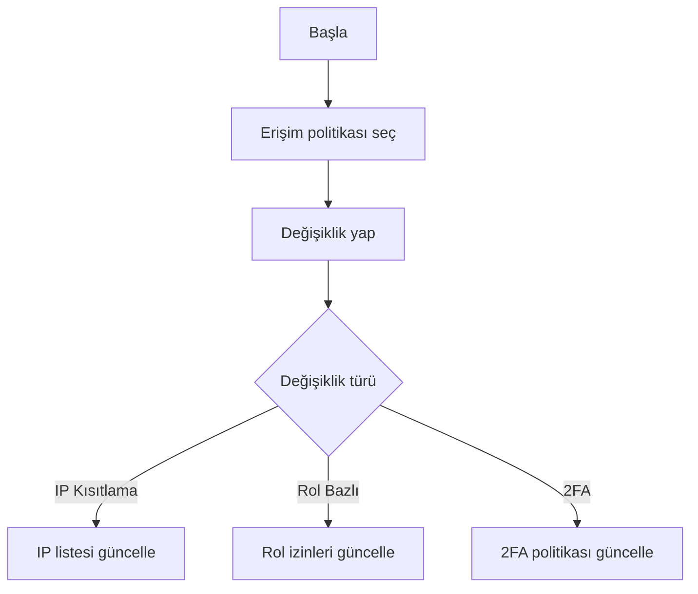

## 4. Sistem İzleme Akışları

### 4.1. Performans İzleme

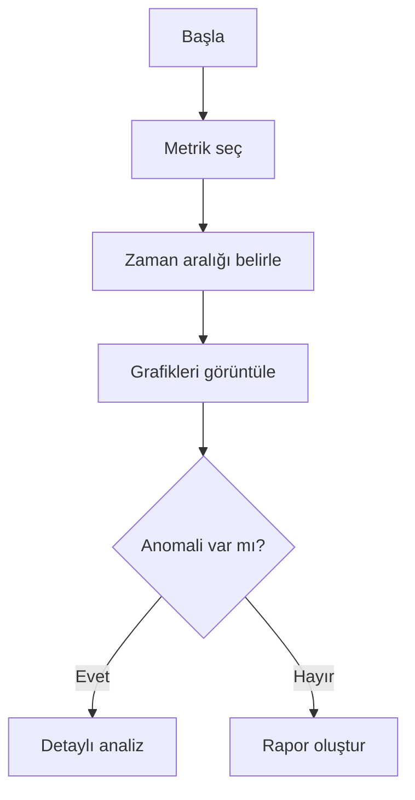

### 4.2. Hata Analizi

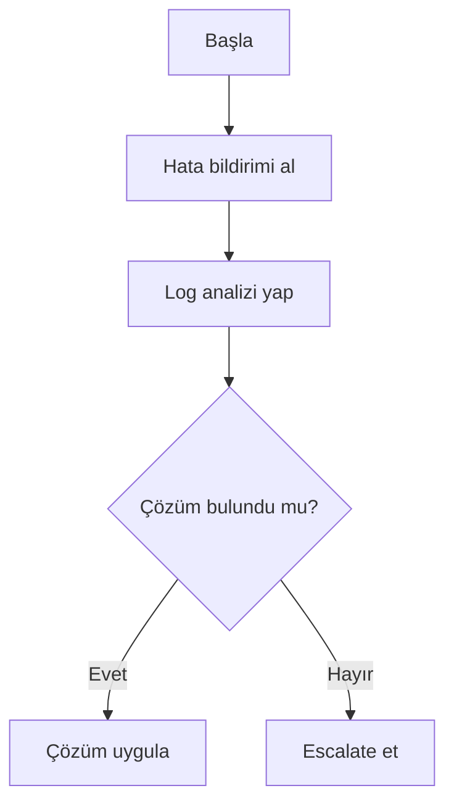

## 5. Yedekleme Yönetimi Akışları

### 5.1. Manuel Yedekleme

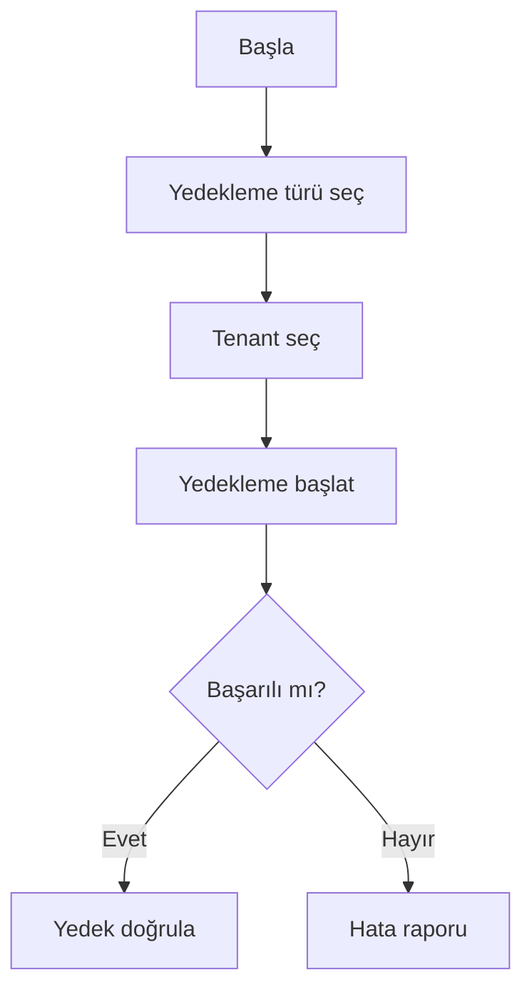

### 5.2. Geri Yükleme

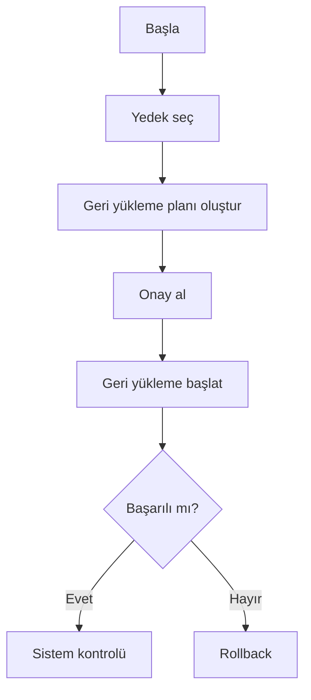

## 6. Raporlama Akışları

### 6.1. Özel Rapor Oluşturma

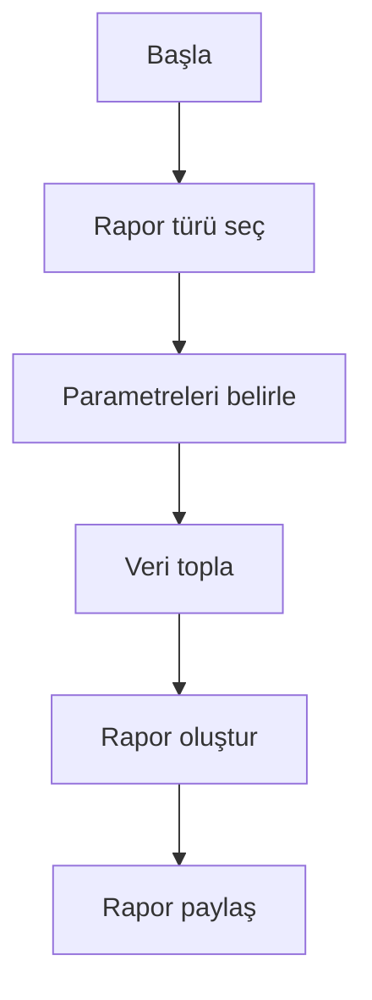

### 6.2. Otomatik Raporlama

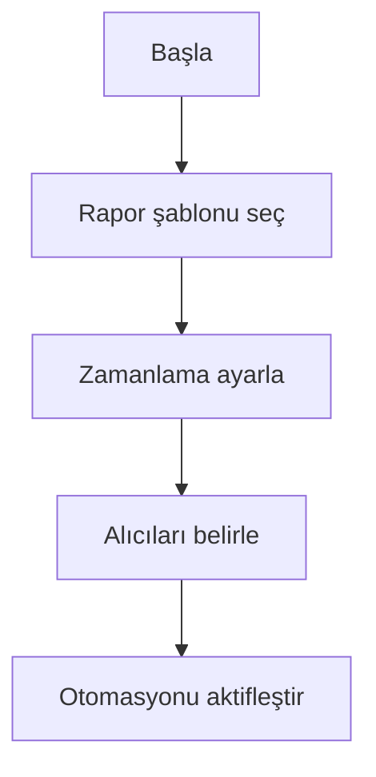

## Kullanıcı Deneyimi Notları

1. **Hata Yönetimi**
   - Her adımda geri bildirim
   - Açık hata mesajları
   - Düzeltme önerileri

2. **İşlem Onayları**
   - Kritik işlemler için çift onay
   - İşlem öncesi etki analizi
   - Geri alma seçeneği

3. **Yardım ve Dokümantasyon**
   - Bağlam duyarlı yardım
   - Adım adım kılavuzlar
   - Video eğitimler

## İlgili Dokümanlar

- [Dashboard Tasarımı](../layouts/super-admin/dashboard.md)
- [Komponent Kütüphanesi](../../components/README.md)
- [API Dokümantasyonu](../../api/super-admin-api.md) 