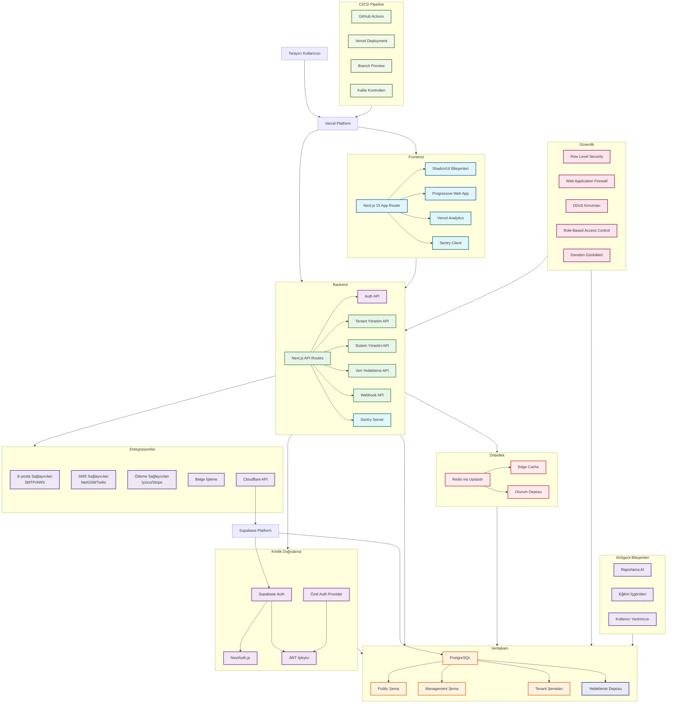

# Iqra Eğitim Portalı - Sistem Mimarisi Diyagramı

Bu belge, Iqra Eğitim Portalı'nın (i-ep.app) kapsamlı sistem mimarisini göstermektedir. Bu çok kiracılı (multi-tenant) SaaS okul yönetim sistemi, Türkiye'deki eğitim kurumları için özel olarak tasarlanmıştır.

## Mimari Genel Bakış

## 1. Ön yüz (Frontend) Bileşenleri

### Teknolojiler
- **Next.js 15**: React framework, App Router, SSR ve SSG desteği
- **TypeScript**: Tip güvenli kod geliştirme 
- **Tailwind CSS**: Utility-first CSS framework
- **Shadcn/UI**: Erişilebilir ve özelleştirilebilir UI komponentleri
- **PWA Desteği**: Mobil cihazlarda yerel uygulama deneyimi

### Ana Bileşenler
- **Sayfa Bileşenleri**: Landing, Dashboard, Auth, Tenant-specific pages
- **UI Komponentleri**: Form elemanları, tablolar, modeller, bildirimler
- **İstemci Önbelleği**: SWR/React Query ile veri önbelleği
- **SEO Optimizasyonu**: Next.js meta tagları ve yapılandırılmış veriler
- **Analitik Entegrasyonu**: Vercel Analytics ve Sentry ile kullanıcı davranışı izleme

## 2. Arka yüz (Backend) Servisleri

### Teknolojiler
- **Next.js API Routes**: Sunucu taraflı API'ler
- **Supabase**: BaaS (Backend as a Service) çözümü
- **Node.js**: Sunucu ortamı
- **TypeScript**: Tip güvenli kod

### Ana Servisler
- **Auth API**: Kimlik doğrulama ve yetkilendirme 
- **Tenant Yönetim API**: Okul/kurum kayıt ve yapılandırma 
- **Domain Yönetim API**: Özel alan adı yönetimi ve doğrulama
- **Kullanıcı Yönetim API**: Kullanıcı CRUD işlemleri
- **Eğitim Verileri API**: Akademik veriler, notlar, devam durumu
- **Ödeme ve Abonelik API**: Faturalandırma ve abonelik yönetimi
- **Bildirim API**: Push, email ve SMS bildirimleri
- **Webhook API**: Üçüncü taraf entegrasyonları için webhook desteği
- **Veri Yedekleme ve Geri Yükleme API**: Tenant verilerini yedekleme

## 3. Veritabanı Mimarisi

### Teknolojiler
- **PostgreSQL**: İlişkisel veritabanı
- **Row Level Security (RLS)**: Tenant-seviyesinde veri izolasyonu
- **Supabase**: Veritabanı yönetimi ve erişimi
- **Redis**: Önbellek ve oturum yönetimi

### Şema Yapısı
- **Public**: Ortak tablolar (users, sessions)
- **Management**: Tenant yönetim tabloları (tenants, domains, subscriptions)
- **Tenant_{id}**: Her tenant için özel şema
  - `students`: Öğrenci kayıtları
  - `teachers`: Öğretmen kayıtları
  - `classes`: Sınıf kayıtları
  - `courses`: Ders kayıtları
  - `attendance`: Devam durumu kayıtları
  - `grades`: Not kayıtları
  - `assignments`: Ödev kayıtları
  - `messages`: Mesaj kayıtları
  - `events`: Etkinlik kayıtları
  - `settings`: Tenant ayarları

## 4. Üçüncü Taraf Entegrasyonlar

### Entegrasyonlar
- **Ödeme İşlemcileri**:
  - Iyzico (Türkiye pazarı için)
  - Stripe (Uluslararası ödemeler için)
- **E-posta Sağlayıcıları**:
  - SMTP
  - AWS SES
- **SMS Sağlayıcıları**:
  - NetGSM (Türkiye)
  - Twilio (Uluslararası)
- **Bulut Depolama**:
  - AWS S3
  - Cloudflare R2
- **Domain Yönetimi**:
  - Cloudflare API (DNS ve SSL yönetimi)
- **Analitik ve İzleme**:
  - Vercel Analytics
  - Sentry (Hata izleme)

## 5. Kimlik Doğrulama ve Yetkilendirme

### Teknolojiler
- **Supabase Auth**: Temel kimlik doğrulama altyapısı
- **NextAuth.js**: Çoklu kimlik doğrulama sağlayıcıları
- **JWT**: JSON Web Token tabanlı oturum yönetimi
- **RBAC**: Rol tabanlı erişim kontrolü

### Kullanıcı Rolleri
- **Süper Admin**: Platform yöneticisi
- **Tenant Admin**: Okul/kurum yöneticisi
- **Öğretmen**: Ders, ödev, not yönetimi
- **Öğrenci**: Ders takibi ve ödevler
- **Veli**: Öğrenci takibi
- **Personel**: İdari personel

## 6. AI/Agent Bileşenleri

### Özellikleri
- **Eğitim İçgörüleri**: Öğrenci performans analitiği
- **Raporlama AI**: Otomatik rapor oluşturma
- **İçerik Önerileri**: Kişiselleştirilmiş öğrenme materyalleri
- **Devam Tahmini**: Devamsızlık riski analizi
- **Kullanıcı Yardımcısı**: AI tabanlı kullanıcı desteği

## 7. Ölçeklenebilirlik ve Yüksek Erişilebilirlik

### Stratejiler
- **Vercel Edge Network**: Global CDN ve edge computing 
- **Supabase Ölçeklendirme**: Veritabanı performans optimizasyonu
- **Database Connection Pooling**: Veritabanı bağlantı yönetimi
- **Redis Önbellek**: Yüksek trafik için veri önbelleği
- **Microservices**: Özelleştirilmiş servisler için mimari hazırlık
- **Tenant İzolasyonu**: Performans sorunlarının tenant bazında izolasyonu

## 8. Güvenlik Katmanları

### Güvenlik Önlemleri
- **Row Level Security (RLS)**: Veritabanı seviyesinde veri izolasyonu
- **JWT Tabanlı Kimlik Doğrulama**: Güvenli oturum yönetimi
- **HTTPS Zorlaması**: Tüm bağlantılar için SSL/TLS
- **CORS Politikaları**: Cross-origin isteklerinin kontrolü
- **Rate Limiting**: API isteklerinin sınırlandırılması
- **Input Validation**: Veri doğrulama ve sanitizasyon
- **Content Security Policy (CSP)**: XSS saldırılarına karşı koruma
- **KVKK Uyumlu Veri İşleme**: Türkiye veri koruma kanunlarına uyum
- **Denetim Günlükleri**: Kritik işlemlerin kaydı

## 9. Deployment ve CI/CD Pipeline

### Araçlar ve Süreçler
- **GitHub**: Kod deposu ve sürüm kontrolü
- **GitHub Actions**: CI/CD otomasyonu
- **Vercel**: Frontend deployment ve hosting
- **Supabase**: Veritabanı ve backend servisleri
- **Docker**: Konteynerizasyon (ek servisler için)
- **Ortamlar**:
  - Development
  - Staging
  - Production
- **Kalite Kontrolleri**:
  - Unit ve Integration Testleri
  - E2E Testleri (Playwright)
  - Kod Kalite Analizi
  - Güvenlik Taramaları

## 10. İzleme ve Operasyonlar

### Araçlar
- **Sentry**: Hata izleme ve performans analizi
- **Vercel Analytics**: Kullanıcı davranışları
- **Uptime Monitoring**: Sistem erişilebilirlik izleme
- **Log Management**: Merkezileştirilmiş log toplama ve analizi
- **Performans İzleme**: Sayfa yükleme süreleri ve API yanıt süreleri
- **Otomatik Alarmlar**: Kritik sorunlar için bildirimler

---

Bu mimari diyagram, Iqra Eğitim Portalı'nın teknik altyapısını ve bileşenlerini kapsamlı bir şekilde göstermektedir. Sistem, modern web teknolojileri kullanılarak çok kiracılı (multi-tenant) bir SaaS uygulaması olarak tasarlanmıştır ve Türkiye'deki eğitim kurumlarının ihtiyaçlarını karşılamayı hedeflemektedir. 