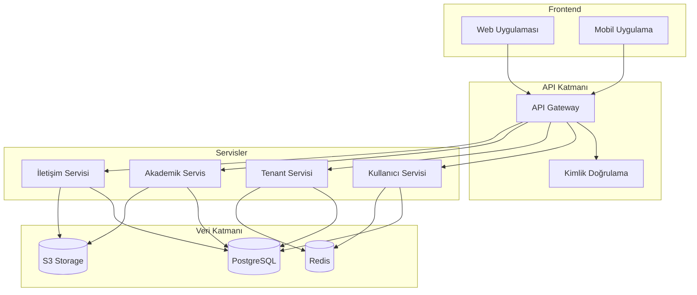
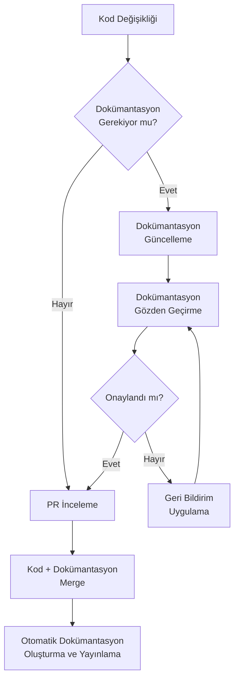

# Geliştirici Dokümantasyonu Planı

## Genel Bakış

Bu doküman, Maarif Okul Portalı projesi için kapsamlı bir geliştirici dokümantasyonu stratejisi ve planı sunmaktadır. İyi hazırlanmış bir geliştirici dokümantasyonu, projenin bakım ve geliştirme sürecini kolaylaştırır, yeni geliştiricilerin daha hızlı adapte olmasını sağlar ve kod kalitesini artırır. Bu plan, dokümantasyon türlerini, içerik stratejisini, sorumlulukları ve süreçleri tanımlamaktadır.

## Dokümantasyon Hedefleri

1. **Geliştirici Verimliliği**: Geliştiricilerin ihtiyaç duydukları bilgilere hızlıca erişebilmelerini sağlamak
2. **Kod Kalitesi**: Standartları ve en iyi uygulamaları tanımlayarak tutarlı kod yazımını teşvik etmek
3. **Onboarding Süreci**: Yeni geliştiricilerin projeye hızlıca adapte olmasını sağlamak
4. **Bilgi Transferi**: Proje bilgisinin tüm ekip üyeleri arasında etkin şekilde paylaşılmasını sağlamak
5. **Teknik Borç Yönetimi**: Kod tabanı ve mimariye ilişkin bilgileri belgeleyerek teknik borcu azaltmak

## Dokümantasyon Türleri ve İçerik Stratejisi

### 1. Kod İçi Dokümantasyon

Kod içi dokümantasyon, doğrudan kaynak kod içinde bulunan ve kodun işlevini, parametrelerini ve davranışını açıklayan yorumları içerir.

#### Kod Yorum Standartları

```typescript
/**
 * Tenant veritabanı bağlantısını oluşturur ve yapılandırır.
 *
 * @param tenantId - Bağlantı oluşturulacak tenant'ın ID'si
 * @param options - Bağlantı yapılandırma seçenekleri
 * @returns Yapılandırılmış veritabanı bağlantısı
 *
 * @example
 * const db = await createTenantConnection('tenant-123', { poolSize: 10 });
 * const users = await db.query('SELECT * FROM users');
 *
 * @throws {TenantNotFoundError} Belirtilen tenant bulunamazsa
 * @throws {DatabaseConnectionError} Veritabanı bağlantısı kurulamazsa
 */
export async function createTenantConnection(
  tenantId: string,
  options?: ConnectionOptions
): Promise<DatabaseConnection> {
  // Uygulama kodu
}
```

#### Kod İçi Dokümantasyon Stratejisi

- **Ne Belgelenmeli**:
  - Tüm public API fonksiyonları, sınıfları ve arayüzleri
  - Karmaşık algoritma ve iş mantığı
  - Kritik bölümler ve potansiyel tuzaklar
  - Özel çözümler ve geçici düzeltmeler

- **Ne Belgelenmemeli**:
  - Kendini açıklayan basit kod
  - Geçici veya deneysel kod (bu kod geliştirme aşamasında olduğunu belirtmelidir)
  - Uygulanmayan veya kullanılmayan kod (bu kod silinmelidir)

- **Yorum Yazma İlkeleri**:
  - Açık, öz ve anlaşılır yorumlar yazın
  - "Ne" yerine "neden" açıklamalarına odaklanın
  - Tüm parametre ve dönüş değerlerini belgeleyin
  - Örnekler ve kullanım senaryoları ekleyin
  - İstisnai durumları ve hata işleme mekanizmalarını belirtin

### 2. API Dokümantasyonu

API dokümantasyonu, sistemin diğer sistemlerle ve bileşenlerle nasıl etkileşime girdiğini tanımlar.

#### REST API Dokümantasyonu

Maarif Okul Portalı'nın REST API'lerini belgelemek için OpenAPI (Swagger) standardını kullanacağız:

```yaml
# openapi.yaml örneği
openapi: 3.0.0
info:
  title: Maarif Okul Portalı API
  description: Maarif Okul Portalı için RESTful API
  version: 1.0.0
paths:
  /api/tenants/{tenantId}/users:
    get:
      summary: Kullanıcıları Listele
      description: Belirli bir tenant için kullanıcıların listesini döndürür
      parameters:
        - name: tenantId
          in: path
          required: true
          schema:
            type: string
        - name: role
          in: query
          schema:
            type: string
            enum: [admin, teacher, student, parent]
      responses:
        '200':
          description: Başarılı
          content:
            application/json:
              schema:
                type: array
                items:
                  $ref: '#/components/schemas/User'
        '404':
          description: Tenant bulunamadı
    # Diğer yöntemler...
```

#### İç API Dokümantasyonu

Frontend'den backend'e, servisler arasında ve diğer iç bileşenler arasındaki API'ler için:

```typescript
// lib/api/types.ts

/**
 * Kullanıcı servisi için API tanımları.
 * Bu modül, kullanıcı yönetimi için gerekli tüm endpoint ve 
 * veri yapılarını tanımlar.
 */

/**
 * Kullanıcı oluşturma isteği.
 */
export interface CreateUserRequest {
  /** Kullanıcının tam adı */
  fullName: string;
  /** Benzersiz e-posta adresi */
  email: string;
  /** Kullanıcı rolü */
  role: 'admin' | 'teacher' | 'student' | 'parent';
  /** Kullanıcı şifresi (hash'lenmemiş) */
  password: string;
}

/**
 * Kullanıcı oluşturma yanıtı.
 */
export interface CreateUserResponse {
  /** Oluşturulan kullanıcının ID'si */
  id: string;
  /** İşlem başarılı mı? */
  success: boolean;
  /** Hata olması durumunda hata mesajı */
  error?: string;
}
```

#### API Dokümantasyon Stratejisi

- Tüm public API'ler için OpenAPI şemaları oluşturun
- İç API'ler için TypeScript arayüzleri ve JSDoc yorumları kullanın
- Örnek istek ve yanıtlar ekleyin
- Hata kodları ve mesajları belgeleyin
- API değişiklik geçmişini (changelog) tutun
- API sürüm politikasını tanımlayın

### 3. Mimari Dokümantasyonu

Mimari dokümantasyonu, sistemin genel yapısını, bileşenlerini ve bunların birbirleriyle nasıl etkileşime girdiğini açıklar.

#### Sistem Mimarisi Diyagramları

Aşağıdaki diyagram türleri oluşturulacak ve güncel tutulacaktır:

- **Bağlam Diyagramı**: Sistemin dış dünya ile etkileşimini gösterir
- **Konteyner Diyagramı**: Üst düzey teknik bileşenleri gösterir
- **Bileşen Diyagramı**: Her bir konteyner içindeki bileşenleri gösterir
- **Kod Diyagramı**: Kritik bileşenlerin iç yapısını gösterir



#### Karar Kayıtları (ADR)

Önemli mimari kararları belgelemek için Mimari Karar Kayıtları (ADR) kullanılacaktır:

```markdown
# ADR-001: Next.js 14 Kullanımı

## Bağlam

Maarif Okul Portalı frontend çerçevesi seçimi için birden fazla alternatif değerlendirildi:
- React + Custom Setup
- Next.js
- Remix
- Nuxt.js (Vue.js tabanlı)

## Karar

Next.js 14 kullanılmasına karar verildi.

## Durum

Kabul edildi, 2023-11-15

## Sonuçlar

### Olumlu

- Server-side rendering ve statik sayfa oluşturma desteği sayesinde daha iyi SEO ve performans
- App Router API ile gelişmiş routing yetenekleri
- React Server Components desteği
- API routes desteği sayesinde backend ve frontend arasında daha iyi entegrasyon
- Otomatik kod bölme ve optimizasyon
- Büyük ve aktif topluluk desteği

### Olumsuz

- Angular veya Vue.js gibi alternatif framework'lerle çalışan geliştiriciler için öğrenme eğrisi
- Bazı gelişmiş senaryolarda custom yapılandırma gerekebilir

### Riskler

- Next.js'in büyük sürüm değişikliklerinde bazı uyumluluğu bozan değişiklikler olabilir
- Özel gereksinimlerin Next.js sınırlamalarına takılması durumunda ek çalışma gerekebilir

## Alternatifler

- **React + Custom Setup**: Daha fazla kontrol sağlar ancak birçok özelliği sıfırdan geliştirmek gerekir
- **Remix**: SSR odaklı iyi bir alternatif ancak topluluğu Next.js kadar büyük değil
- **Nuxt.js**: Vue.js tabanlı olması tercih edilmedi çünkü ekip React konusunda daha deneyimli
```

#### Mimari Dokümantasyon Stratejisi

- C4 model kullanarak sistem mimarisini farklı detay seviyelerinde belgeleyin
- Önemli mimari kararları ADR formatında kaydedin
- Bileşenler arasındaki bağımlılıkları ve veri akışını belirtin
- Ölçeklenebilirlik, güvenlik ve bakım ile ilgili mimari kararları açıklayın
- Teknoloji yığınını ve seçim nedenlerini belgeleyin

### 4. Teknik Kılavuzlar

Teknik kılavuzlar, geliştiricilerin belirli görevleri nasıl gerçekleştireceklerini adım adım açıklar.

#### Geliştirme Ortamı Kurulumu

```markdown
# Geliştirme Ortamı Kurulumu

## Ön Gereksinimler

- Node.js 18.x veya üzeri
- npm 8.x veya üzeri
- PostgreSQL 14.x veya üzeri
- Git

## Kurulum Adımları

### 1. Depoyu Klonlama

```bash
git clone https://github.com/maarifportal/maarifokul.git
cd maarifokul
```

### 2. Bağımlılıkları Yükleme

```bash
npm install
```

### 3. Çevre Değişkenlerini Yapılandırma

.env.example dosyasını .env.local olarak kopyalayın ve gerekli bilgileri doldurun:

```bash
cp .env.example .env.local
# .env.local dosyasını düzenleyin
```

### 4. Veritabanını Kurma

```bash
npm run db:migrate
npm run db:seed
```

### 5. Geliştirme Sunucusunu Başlatma

```bash
npm run dev
```

## Yaygın Sorunlar ve Çözümleri

### PostgreSQL Bağlantı Hatası

PostgreSQL bağlantı hatası alırsanız:
1. PostgreSQL servisinin çalıştığından emin olun
2. .env.local dosyasındaki bağlantı bilgilerini kontrol edin
3. Veritabanı kullanıcısının yeterli yetkiye sahip olduğunu doğrulayın
```

#### İş Akışları ve Süreçler

```markdown
# Özellik Geliştirme İş Akışı

Bu doküman, Maarif Okul Portalı projesi için özellik geliştirme sürecini tanımlar.

## Geliştirme İş Akışı

1. **Görev Atama**: Görev JIRA'da atanır ve "In Progress" durumuna alınır
2. **Branch Oluşturma**: `feature/JRA-XXX-feature-description` formatında bir branch oluşturun
3. **Geliştirme**: Kodu geliştirin ve yerel olarak test edin
4. **Testleri Yazma**: Gerekli unit ve integration testlerini yazın
5. **Kod Kontrolü**: Kodu yerel olarak lint ve format kontrolünden geçirin
6. **Commit**: Conventional Commits formatında commit yapın
7. **Push**: Branch'i uzak depoya push edin
8. **PR Oluşturma**: GitHub'da bir Pull Request oluşturun
9. **CI Kontrolü**: CI testlerinin başarıyla tamamlanmasını bekleyin
10. **Code Review**: En az bir takım üyesinden code review alın
11. **Geribildirim**: Aldığınız geribildirimlere göre kodu düzeltin
12. **Merge**: PR'ı main branch'e merge edin
13. **Görev Güncelleme**: JIRA görevini "Done" durumuna güncelleyin

## Pull Request Kontrolü

PR'lar merge edilmeden önce aşağıdaki kriterleri karşılamalıdır:

- [ ] Kod standartlarına uyuyor
- [ ] Yeterli test kapsamı var (min. %80)
- [ ] CI kontrollerini geçti
- [ ] En az 1 code review onayı aldı
- [ ] Dokümantasyon güncellenmiş veya eklenmiş
- [ ] Performans etkileri değerlendirilmiş
```

#### Teknik Kılavuz Stratejisi

- Geliştirme ortamı kurulumu için detaylı talimatlar sağlayın
- Yaygın görevler için adım adım rehberler hazırlayın
- Örneklerle desteklenmiş kod parçacıkları ekleyin
- Sorun giderme ipuçları ve yaygın hatalar için çözümler belirtin
- Kod standartları ve en iyi uygulamaları tanımlayın

### 5. Referans Dokümantasyonu

Referans dokümantasyonu, geliştirici araç setinin kapsamlı bir açıklamasını içerir.

#### Veri Modellerini Belgeleme

```markdown
# Veri Modelleri

Bu doküman, Maarif Okul Portalı'nın temel veri modellerini tanımlar.

## Tenant

Tenant modeli, sistemi kullanan eğitim kurumlarını temsil eder.

### Şema

| Alan | Tip | Açıklama | Zorunlu |
|------|-----|----------|---------|
| id | UUID | Benzersiz tanımlayıcı | Evet |
| name | String | Kurumun adı | Evet |
| subdomain | String | Subdomain adı | Evet |
| plan_type | Enum | Abonelik planı: 'free', 'standard', 'premium' | Evet |
| status | Enum | Tenant durumu: 'active', 'suspended', 'trial' | Evet |
| created_at | DateTime | Oluşturulma tarihi | Evet |
| expires_at | DateTime | Abonelik bitiş tarihi | Hayır |
| settings | JSONB | Tenant yapılandırma ayarları | Hayır |

### İlişkiler

- **Users**: Tenant'a ait kullanıcılar (one-to-many)
- **Subscriptions**: Tenant'ın abonelik geçmişi (one-to-many)
- **Settings**: Tenant özel ayarları (one-to-one)

### İndeksler

- `tenant_subdomain_idx`: `subdomain` alanı üzerinde unique indeks
- `tenant_created_at_idx`: `created_at` alanı üzerinde indeks

### Örnek

```json
{
  "id": "550e8400-e29b-41d4-a716-446655440000",
  "name": "Atatürk İlkokulu",
  "subdomain": "ataturk",
  "plan_type": "standard",
  "status": "active",
  "created_at": "2023-01-15T08:30:00Z",
  "expires_at": "2024-01-15T08:30:00Z",
  "settings": {
    "theme": "blue",
    "features": {
      "advancedReporting": true,
      "apiAccess": false
    },
    "logo_url": "https://storage.maarifportal.com/tenants/550e8400/logo.png"
  }
}
```
```

#### Yapılandırma Seçenekleri Belgeleme

```markdown
# Sistem Yapılandırması

Bu doküman, Maarif Okul Portalı'nın yapılandırma seçeneklerini tanımlar.

## Çevre Değişkenleri

| Değişken | Açıklama | Varsayılan | Zorunlu |
|----------|----------|------------|---------|
| `DATABASE_URL` | PostgreSQL bağlantı dizesi | - | Evet |
| `REDIS_URL` | Redis bağlantı dizesi | - | Evet |
| `JWT_SECRET` | JWT token imzalama anahtarı | - | Evet |
| `S3_BUCKET` | Dosya depolama için S3 bucket adı | - | Evet |
| `S3_REGION` | S3 bölgesi | `eu-central-1` | Hayır |
| `LOG_LEVEL` | Günlük kaydı seviyesi | `info` | Hayır |
| `PORT` | Sunucu portu | `3000` | Hayır |
| `NODE_ENV` | Çalışma ortamı | `development` | Hayır |

## Tenant Yapılandırma Seçenekleri

Tenant'a özgü yapılandırma seçenekleri JSON formatında depolanır:

```json
{
  "branding": {
    "logo": "string",
    "favicon": "string",
    "primary_color": "string",
    "secondary_color": "string"
  },
  "features": {
    "advanced_analytics": boolean,
    "api_access": boolean,
    "white_labeling": boolean,
    "sms_notifications": boolean
  },
  "limits": {
    "max_users": number,
    "max_storage_gb": number,
    "max_api_calls_per_day": number
  },
  "security": {
    "mfa_required": boolean,
    "password_expiry_days": number,
    "session_timeout_minutes": number,
    "allowed_ip_ranges": string[]
  }
}
```
```

#### Referans Dokümantasyon Stratejisi

- Tüm veri modellerini ve aralarındaki ilişkileri belgeleyin
- API endpoint'lerini ve parametrelerini kataloglayın
- Yapılandırma seçeneklerini ve çevre değişkenlerini listeleyin
- Statik ve dinamik konfigürasyon yönetimini açıklayın
- Yaygın desenlerin ve kütüphanelerin kullanımını belgeleyin

## Dokümantasyon Üretimi ve Bakımı

### Dokümantasyon Araçları

Aşağıdaki araçlar dokümantasyon iş akışımızı destekleyecektir:

- **TypeDoc**: TypeScript kodu için dokümantasyon oluşturma
- **Swagger UI**: REST API dokümantasyonu
- **Storybook**: UI bileşenlerinin dokümantasyonu
- **ESLint + JSDoc**: Kod yorum standartlarını denetleme
- **Docusaurus**: Teknik dokümantasyon web sitesi
- **Mermaid.js**: Diyagram oluşturma
- **MDX**: İnteraktif Markdown dokümantasyonu

### Otomatik Dokümantasyon Üretimi

```yaml
# .github/workflows/docs.yml
name: Generate Documentation

on:
  push:
    branches: [main]
  pull_request:
    branches: [main]

jobs:
  build-docs:
    runs-on: ubuntu-latest
    steps:
      - name: Checkout code
        uses: actions/checkout@v3
      
      - name: Setup Node.js
        uses: actions/setup-node@v3
        with:
          node-version: '18'
      
      - name: Install dependencies
        run: npm ci
      
      - name: Generate API docs
        run: npm run docs:api
      
      - name: Generate TypeDoc
        run: npm run docs:typedoc
      
      - name: Build Docusaurus site
        run: |
          cd docs
          npm ci
          npm run build
      
      - name: Deploy to GitHub Pages
        if: github.event_name == 'push'
        uses: peaceiris/actions-gh-pages@v3
        with:
          github_token: ${{ secrets.GITHUB_TOKEN }}
          publish_dir: ./docs/build
```

### Dokümantasyon Kalite Kontrolleri

Dokümantasyon kalitesini sağlamak için:

1. **Linting Kontrolleri**: Yorum formatı ve dokümantasyon standartları için ESLint kuralları
2. **Kapsam Kontrolleri**: Public API'lerin dokümantasyon kapsamını doğrulama
3. **Bağlantı Doğrulama**: Kırık bağlantıları tespit edip düzeltme
4. **Güncellik Kontrolü**: Dokümantasyonun kodla senkronize olduğunu doğrulama
5. **Yazım ve Dil Kontrolleri**: Yazım hatalarını ve dil tutarlılığını kontrol etme

## Sorumluluklar ve İş Akışı

### Dokümantasyon Rolü ve Sorumlulukları

1. **Dokümantasyon Sorumlusu**:
   - Dokümantasyon stratejisini ve planını geliştirme
   - Dokümantasyon kalite standartlarını belirleme
   - Dokümantasyon araçlarını ve süreçlerini yönetme

2. **Geliştirici Sorumlulukları**:
   - Yazdıkları kodla ilgili kod içi dokümantasyonu sağlama
   - Teknik özellikler için dokümantasyon taslakları oluşturma
   - Dokümantasyon geri bildirimlerine yanıt verme

3. **Teknik Yazarlar** (varsa):
   - Dokümantasyon içeriğini düzenleme ve iyileştirme
   - Teknik içeriği son kullanıcılar için anlaşılır hale getirme
   - Dokümantasyon yapısını ve organizasyonunu iyileştirme

### Dokümantasyon İş Akışı



## Eğitim ve Onboarding

### Dokümantasyon Oluşturma Eğitimi

Tüm geliştiriciler için dokümantasyon eğitimi sağlanacaktır:

1. **Dokümantasyon Araçları Eğitimi**:
   - JSDoc ve TypeDoc kullanımı
   - Markdown ve MDX yazımı
   - Diyagram oluşturma (Mermaid.js)

2. **Dokümantasyon Standartları Eğitimi**:
   - Yorum yazma kılavuzları
   - API dokümantasyon formatları
   - Teknik yazım stil kılavuzu

3. **İncelemeci Eğitimi**:
   - Dokümantasyon inceleme kontrol listesi
   - Etkili geri bildirim sağlama
   - Dokümantasyon kalitesini değerlendirme

### Yeni Geliştirici Onboarding Süreci

Yeni geliştiriciler için dokümantasyon odaklı onboarding süreci:

1. **Dokümantasyon Oryantasyonu**:
   - Dokümantasyon yapısı ve nasıl gezineceği
   - Nerede hangi bilgilerin bulunduğu
   - Dokümantasyon süreci ve araçları

2. **Dokümantasyon Egzersizleri**:
   - Kod içi dokümantasyon ekleme alıştırmaları
   - API dokümantasyonu yazma
   - Teknik kılavuz hazırlama

3. **Dokümantasyon Mentorluğu**:
   - İlk dokümantasyon katkılarında rehberlik
   - Dokümantasyon geri bildirimleri ve iyileştirme

## Dokümantasyon Değerlendirme ve İyileştirme

### Dokümantasyon Metrikleri

Dokümantasyon kalitesini ve etkinliğini ölçmek için:

- **Dokümantasyon Kapsamı**: Belgelenen API yüzdesi
- **Dokümantasyon Güncelliği**: Güncel olmayan dokümantasyon yüzdesi
- **Dokümantasyon Kullanımı**: Dokümantasyon sayfası görüntülenme sayısı
- **Dokümantasyon Geri Bildirimleri**: Dokümantasyon ile ilgili olumlu/olumsuz geri bildirimler
- **Onboarding Hızı**: Yeni geliştiricilerin verimli hale gelme süresi

### Sürekli İyileştirme Süreci

Dokümantasyon sürekli iyileştirme döngüsü:

1. **Veri Toplama**: Dokümantasyon metrikleri ve geri bildirimleri toplama
2. **Analiz**: Dokümantasyondaki boşlukları ve sorunları tanımlama
3. **İyileştirme Planı**: İyileştirmeler için önceliklendirme ve plan oluşturma
4. **Uygulama**: İyileştirmeleri uygulama ve test etme
5. **Değerlendirme**: Değişikliklerin etkisini değerlendirme

## Uygulama Yol Haritası

### Faz 1: Temel Dokümantasyon Altyapısı (1-2 Ay)

- [ ] Dokümantasyon araçlarını seçme ve yapılandırma
- [ ] Dokümantasyon standartlarını ve şablonlarını oluşturma
- [ ] Kod yorum kurallarını ve ESLint entegrasyonunu kurma
- [ ] Docusaurus dokümantasyon sitesini kurma
- [ ] Otomatik dokümantasyon CI/CD pipeline'ını oluşturma

### Faz 2: Temel Dokümantasyon Oluşturma (2-3 Ay)

- [ ] Mimari dokümantasyonu oluşturma
- [ ] Temel API dokümantasyonunu oluşturma
- [ ] Veri modellerini belgeleme
- [ ] Temel teknik kılavuzları hazırlama
- [ ] Geliştirici onboarding dokümantasyonunu oluşturma

### Faz 3: İleri Dokümantasyon ve İyileştirme (3-6 Ay)

- [ ] Tüm API'lerin dokümantasyonunu tamamlama
- [ ] UI bileşen kataloğunu oluşturma (Storybook)
- [ ] ADR'leri oluşturma ve mimari kararları belgeleme
- [ ] Gelişmiş eğitim materyalleri oluşturma
- [ ] Dokümantasyon kullanım analizleri ve iyileştirmeler

### Faz 4: Dokümantasyon Sürdürülebilirliği (6+ Ay)

- [ ] Dokümantasyon bakım süreçlerini otomatikleştirme
- [ ] Geliştiriciler için dokümantasyon contribution rehberleri oluşturma
- [ ] Dokümantasyon kalite güvence süreçlerini iyileştirme
- [ ] Topluluk katkılarını teşvik etme ve yönetme
- [ ] Dokümantasyon etki analizleri ve ROI ölçümü

## Ekler

### Dokümantasyon Şablonları

#### Kod İçi Dokümantasyon Şablonu

```typescript
/**
 * [Fonksiyon/Sınıf/Arayüz Adı] - Kısa açıklama.
 *
 * Daha detaylı açıklama buraya yazılır. Birden fazla
 * paragrafa bölünebilir.
 *
 * @param {Type} paramName - Parametre açıklaması
 * @param {Type} [optionalParam] - Opsiyonel parametre açıklaması
 * @returns {ReturnType} Dönüş değeri açıklaması
 *
 * @example
 * // Basit kullanım örneği
 * const result = myFunction(param1, param2);
 *
 * @example
 * // Daha karmaşık bir kullanım örneği
 * const options = { option1: 'value' };
 * const result = myFunction(param1, param2, options);
 *
 * @throws {ErrorType} Hata durumu açıklaması
 */
```

#### API Dokümantasyon Şablonu

```yaml
# OpenAPI şablonu
paths:
  /api/resource:
    get:
      summary: Özet açıklama
      description: |
        Daha detaylı açıklama.
        Birden fazla satır olabilir.
      parameters:
        - name: paramName
          in: query
          required: true
          schema:
            type: string
          description: Parametre açıklaması
      responses:
        '200':
          description: Başarılı yanıt açıklaması
          content:
            application/json:
              schema:
                $ref: '#/components/schemas/ResponseType'
              example:
                property1: value1
                property2: value2
        '404':
          description: Bulunamadı hatası açıklaması
      tags:
        - TagName
```

#### Mimari Karar Kaydı (ADR) Şablonu

```markdown
# ADR-NNN: Karar Başlığı

## Bağlam

Kararın arka planı ve bağlamı. Problemi ve çözüm arayışını açıklayın.

## Karar

Alınan kararın açık ifadesi.

## Durum

[Önerilen, Kabul Edildi, Reddedildi, Değiştirildi, Kullanımdan Kaldırıldı]

Karar tarihi: YYYY-MM-DD

## Sonuçlar

### Olumlu

- Olumlu sonuç 1
- Olumlu sonuç 2

### Olumsuz

- Olumsuz sonuç 1
- Olumsuz sonuç 2

### Riskler

- Risk 1
- Risk 2

## Alternatifler

Değerlendirilen alternatifler ve neden seçilmedikleri.
```

## Sonuç

Bu geliştirici dokümantasyonu planı, Maarif Okul Portalı projesinin çeşitli dokümantasyon ihtiyaçlarını karşılamayı amaçlamaktadır. İyi bir geliştirici dokümantasyonu, daha yüksek kod kalitesi, daha hızlı geliştirici onboarding'i ve daha sürdürülebilir bir geliştirme süreci sağlayacaktır.

Dokümantasyon bir süreç olarak görülmeli ve projenin yaşam döngüsü boyunca sürekli geliştirilmelidir. Ekip üyelerinin katkılarını teşvik etmek ve dokümantasyon kalitesini ölçmek için metrikler ve süreçler oluşturulmalıdır.

## İlgili Kaynaklar

- [Proje Planı](project-plan.md)
- [Teknik Borç Yönetim Stratejisi](technical-debt.md)
- [SLA Tanımları](sla-definitions.md)
- [Multi-Tenant Stratejisi](architecture/multi-tenant-strategy.md)

## API Endpoint'leri

### Domain Yönetimi API'leri
- `POST /api/tenant/domains/add`: Yeni özel domain ekler
- `POST /api/tenant/domains/verify`: Domain doğrulama durumunu kontrol eder
- `GET /api/tenant/domains/list`: Tenant'a ait tüm domainleri listeler
- `DELETE /api/tenant/domains/delete`: Domain kaydını siler

### Öğrenci Yönetimi API'leri

// ... diğer API'ler devam ediyor

## Servisler ve Modüller

### Domain Yönetim Modülü
- `CloudflareDomainManager`: Cloudflare API ile iletişim kuran sınıf
- `DomainService`: Domain işlemlerini yöneten servis
- `TenantDomain`: Domain kayıt modeli

### Middleware

#### Tenant Tespiti
- Host header'a göre subdomain veya özel domain tespiti
- Tenant bilgisinin request header'larına eklenmesi