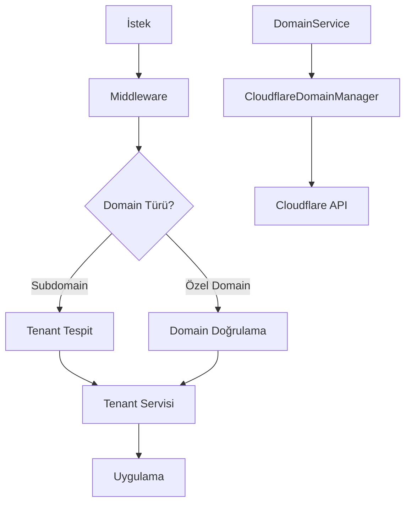

# Domain Yönetimi

Bu belge, Maarif Okul Portalı'nda domain yönetimi, tenant-domain ilişkileri ve domain doğrulama süreçleri hakkında detaylı bilgiler içerir.

## İçerik

- [Genel Bakış](#genel-bakış)
- [Domain Türleri](#domain-türleri)
- [Altyapı Mimarisi](#altyapı-mimarisi)
- [Domain Doğrulama Süreci](#domain-doğrulama-süreci)
- [SSL Sertifikaları](#ssl-sertifikaları)
- [DNS Yapılandırması](#dns-yapılandırması)
- [Sorun Giderme](#sorun-giderme)
- [API Referansı](#api-referansı)

## Genel Bakış

Maarif Okul Portalı, çok kiracılı (multi-tenant) bir mimari kullanır ve her kiracı (okul) benzersiz bir subdomain üzerinden veya özel domain aracılığıyla erişilebilir. Domain yönetimi, tenant izolasyonu ve erişim kontrolünün önemli bir parçasıdır.

Sistem şu domain yapılandırmalarını destekler:

1. **Subdomain**: `okuladi.maarifportal.com`
2. **Özel Domain**: `okuladi.com` veya `portal.okuladi.com`

## Domain Türleri

### Subdomain

Her tenant oluşturulduğunda, otomatik olarak bir subdomain atanır ve yapılandırılır. Bu, Cloudflare DNS üzerinde bir CNAME kaydı oluşturularak ve SSL sertifikası sağlanarak gerçekleştirilir.

**Özellikler:**
- Otomatik oluşturma ve yapılandırma
- Hazır SSL sertifikası
- Ücretsiz plana dahil

**Kısıtlamalar:**
- Sadece alfanumerik karakterler ve kısa çizgi kullanılabilir
- Maksimum 63 karakter uzunluğunda olabilir

### Özel Domain

Premium plan aboneleri, kendi özel domainlerini sisteme ekleyebilirler. Bu, kurumsal kimlik ve marka uyumu için avantaj sağlar.

**Özellikler:**
- Özel marka ve kurumsal kimlik
- Tam DNS kontrolü
- Üst düzey profesyonel görünüm

**Kısıtlamalar:**
- Yalnızca premium plan aboneleri kullanabilir
- DNS doğrulama ve yapılandırma gerektirir
- Manuel doğrulama süreci

## Altyapı Mimarisi

Domain yönetim sistemi aşağıdaki bileşenlerden oluşur:

1. **CloudflareDomainManager**: Cloudflare API ile etkileşim sağlar ve DNS kayıtları, SSL sertifikaları ve doğrulama işlemlerini yönetir.
2. **DomainService**: Domain işlemlerini kapsülleyen servis katmanı, veritabanı ve Cloudflare arasında köprü görevi görür.
3. **Middleware**: İstek yönlendirme, tenant tespit etme ve domain bazlı izolasyon sağlar.
4. **Domain Veritabanı Şeması**: `tenant_domains` tablosu domain kayıtlarını ve ilişkileri tutar.



## Domain Doğrulama Süreci

### Subdomain Doğrulama

Subdomain oluşturma otomatiktir ve doğrulama gerekmez. Sistem, DNS kaydını oluşturur ve SSL sertifikasını yapılandırır.

### Özel Domain Doğrulama

Özel domain eklemek için doğrulama adımları:

1. **DNS Doğrulama**: Kullanıcı, kendi DNS sağlayıcısında bir CNAME kaydı oluşturmalıdır:
   ```
   CNAME example.com -> maarifportal.com
   ```

2. **Doğrulama Kontrolü**: Sistem, düzenli aralıklarla doğrulama durumunu kontrol eder ve doğrulama tamamlandığında domain'i aktifleştirir.

3. **SSL Sertifikası**: Domain doğrulandıktan sonra, Cloudflare otomatik olarak SSL sertifikası sağlar.

## SSL Sertifikaları

Tüm domainler için SSL sertifikaları otomatik olarak Cloudflare tarafından sağlanır. Bu, güvenli HTTPS bağlantıları için gereklidir.

**Özellikler:**
- Otomatik yenileme
- Geniş tarayıcı uyumluluğu
- HTTP/2 desteği
- Gelişmiş güvenlik özellikleri

## DNS Yapılandırması

### Subdomain DNS Yapılandırması

```
[subdomain].[base-domain].com. CNAME [app-url]
```

Örnek:
```
okul1.maarifportal.com. CNAME maarifportal.com
```

### Özel Domain DNS Yapılandırması

```
[custom-domain].com. CNAME [base-domain].com
```

veya

```
portal.[custom-domain].com. CNAME [base-domain].com
```

## Sorun Giderme

### Yaygın Sorunlar ve Çözümleri

1. **Domain Doğrulama Hatası**
   
   Sorun: Domain doğrulama süreci tamamlanamıyor.
   
   Çözüm:
   - DNS önbelleği temizlemeyi bekleyin (24 saate kadar sürebilir)
   - DNS kayıtlarının doğru yapılandırıldığından emin olun
   - DNS propagasyonunu kontrol edin (`dig` veya `nslookup` ile)

2. **SSL Hatası**
   
   Sorun: SSL sertifikası oluşturulamıyor veya geçersiz.
   
   Çözüm:
   - Domain doğrulamasının tamamlandığından emin olun
   - Cloudflare'de SSL modunun "Full" olarak ayarlandığını kontrol edin
   - 24 saat bekleyin, SSL oluşturma zaman alabilir

3. **Subdomain Çakışması**
   
   Sorun: Seçilen subdomain zaten kullanımda.
   
   Çözüm:
   - Farklı bir subdomain adı seçin
   - Mevcut tenant'ın silinmesini bekleyin (eğer eski bir tenant ise)

## API Referansı

### Domain Servisi

```typescript
// Domain kayıt yapısı
interface DomainRecord {
  id: string;
  tenant_id: string;
  domain: string;
  is_primary: boolean;
  is_verified: boolean;
  type: 'subdomain' | 'custom';
  created_at: Date;
  verified_at?: Date;
}

// Temel domain işlemleri
class DomainService {
  // Subdomain oluştur
  async createSubdomain(subdomain: string, tenantId: string): Promise<DomainRecord>;
  
  // Özel domain ekle
  async addCustomDomain(domain: string, tenantId: string, isPrimary?: boolean): Promise<DomainRecord>;
  
  // Domain yapılandırmasını doğrula
  async verifyDomain(domainId: string): Promise<boolean>;
  
  // Domain sil
  async deleteDomain(domainId: string): Promise<boolean>;
  
  // Tenant'a ait domainleri getir
  async getDomainsByTenantId(tenantId: string): Promise<DomainRecord[]>;
  
  // Primary domain'i değiştir
  async setPrimaryDomain(domainId: string, tenantId: string): Promise<boolean>;
}
```

### Domain API Endpoints

| Endpoint | Metod | Açıklama |
|----------|-------|----------|
| `/api/domains` | GET | Tenant'a ait tüm domainleri listeler |
| `/api/domains/verify/{domainId}` | POST | Domain doğrulama işlemini başlatır |
| `/api/domains/{domainId}` | DELETE | Domain'i siler |
| `/api/domains/{domainId}/primary` | PUT | Domain'i primary olarak ayarlar |
| `/api/domains/subdomain` | POST | Yeni subdomain oluşturur |
| `/api/domains/custom` | POST | Özel domain ekler | 