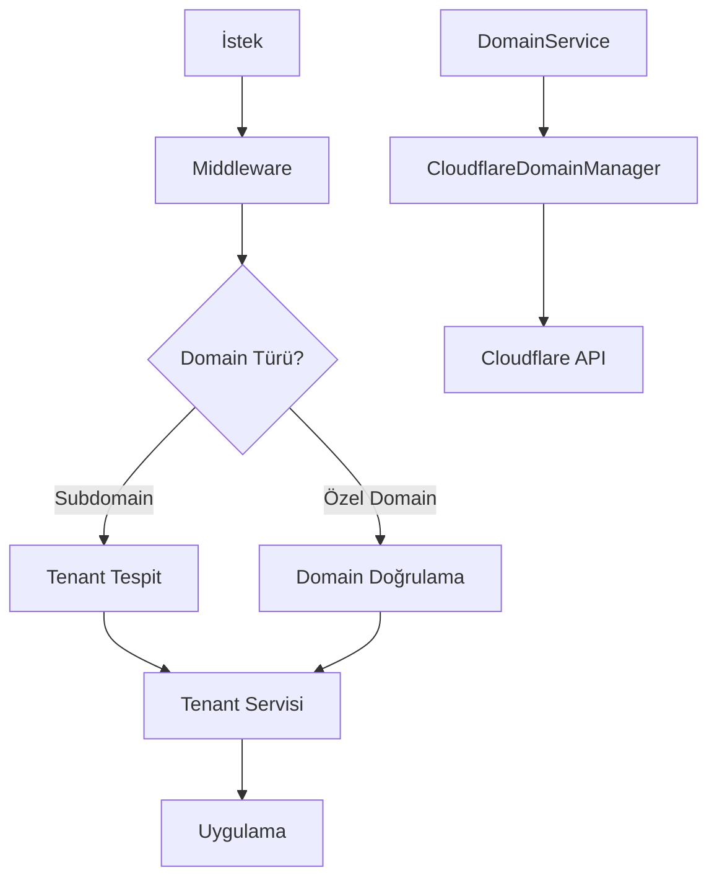

# Domain Yönetimi

Bu belge, Iqra Eğitim Portalı'nda domain yönetimi, tenant-domain ilişkileri ve domain doğrulama süreçleri hakkında detaylı bilgiler içerir.

## İçerik

- [Genel Bakış](#genel-bakış)
- [Domain Türleri](#domain-türleri)
- [Altyapı Mimarisi](#altyapı-mimarisi)
- [Domain Doğrulama Süreci](#domain-doğrulama-süreci)
- [SSL Sertifikaları](#ssl-sertifikaları)
- [DNS Yapılandırması](#dns-yapılandırması)
- [Sorun Giderme](#sorun-giderme)
- [API Referansı](#api-referansı)

## Genel Bakış

Iqra Eğitim Portalı, çok kiracılı (multi-tenant) bir mimari kullanır ve her kiracı (okul) benzersiz bir subdomain üzerinden veya özel domain aracılığıyla erişilebilir. Domain yönetimi, tenant izolasyonu ve erişim kontrolünün önemli bir parçasıdır.

Sistem şu domain yapılandırmalarını destekler:

1. **Subdomain**: `okuladi.i-ep.app`
2. **Özel Domain**: `okuladi.com` veya `portal.okuladi.com`

## Domain Türleri

### Subdomain

Her tenant oluşturulduğunda, otomatik olarak bir subdomain atanır ve yapılandırılır. Bu, Cloudflare DNS üzerinde bir CNAME kaydı oluşturularak ve SSL sertifikası sağlanarak gerçekleştirilir.

**Özellikler:**
- Otomatik oluşturma ve yapılandırma
- Hazır SSL sertifikası
- Ücretsiz plana dahil

**Kısıtlamalar:**
- Sadece alfanumerik karakterler ve kısa çizgi kullanılabilir
- Maksimum 63 karakter uzunluğunda olabilir

### Özel Domain

Premium plan aboneleri, kendi özel domainlerini sisteme ekleyebilirler. Bu, kurumsal kimlik ve marka uyumu için avantaj sağlar.

**Özellikler:**
- Özel marka ve kurumsal kimlik
- Tam DNS kontrolü
- Üst düzey profesyonel görünüm

**Kısıtlamalar:**
- Yalnızca premium plan aboneleri kullanabilir
- DNS doğrulama ve yapılandırma gerektirir
- Manuel doğrulama süreci

## Altyapı Mimarisi

Domain yönetim sistemi aşağıdaki bileşenlerden oluşur:

1. **CloudflareDomainManager**: Cloudflare API ile etkileşim sağlar ve DNS kayıtları, SSL sertifikaları ve doğrulama işlemlerini yönetir.
2. **DomainService**: Domain işlemlerini kapsülleyen servis katmanı, veritabanı ve Cloudflare arasında köprü görevi görür.
3. **Middleware**: İstek yönlendirme, tenant tespit etme ve domain bazlı izolasyon sağlar.
4. **Domain Veritabanı Şeması**: `tenant_domains` tablosu domain kayıtlarını ve ilişkileri tutar.



## Domain Doğrulama Süreci

### Subdomain Doğrulama

Subdomain oluşturma otomatiktir ve doğrulama gerekmez. Sistem, DNS kaydını oluşturur ve SSL sertifikasını yapılandırır.

### Özel Domain Doğrulama

Özel domain eklemek için doğrulama adımları:

1. **DNS Doğrulama**: Kullanıcı, kendi DNS sağlayıcısında bir CNAME kaydı oluşturmalıdır:
   ```