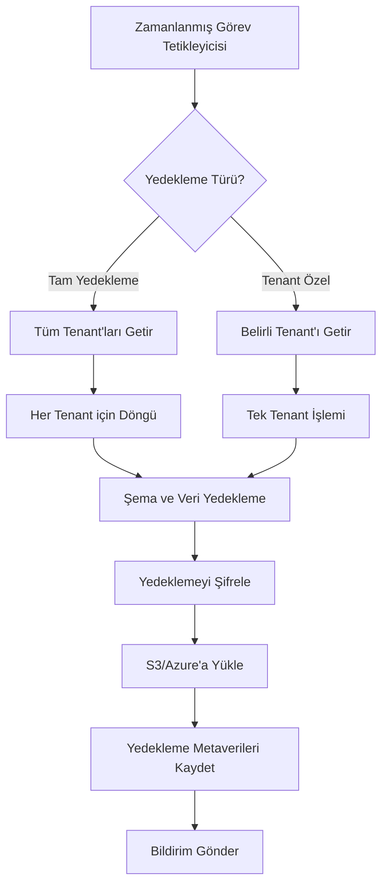

# Maarif Okul Portalı - Yedekleme ve Geri Yükleme Stratejisi

## 1. Genel Bakış

Maarif Okul Portalı, çok kiracılı (multi-tenant) bir SaaS uygulaması olarak, farklı okulların verilerini güvenli bir şekilde saklar ve yönetir. Bu dokümantasyon, veri yedekleme, geri yükleme ve taşınabilirlik stratejilerimizi kapsamlı bir şekilde açıklar.

## 2. Tenant Bazlı Yedekleme Stratejisi

### 2.1 Yedekleme Kapsam ve Sıklıkları

| Yedekleme Türü | Sıklık | Saklama Süresi | Kapsam |
|----------------|--------|----------------|--------|
| Tam Yedekleme | Günlük (gece) | 30 gün | Tüm tenant verileri ve şemalar |
| Artımlı Yedekleme | Saatlik | 7 gün | Değişen veriler |
| Anlık Yedekleme (Snapshot) | Haftalık | 90 gün | Tam sistem durumu |
| Tenant Özel Yedekleme | Manuel/İstek üzerine | 30 gün | Tek bir tenant'ın verileri |

### 2.2 Yedekleme Metodolojisi

1. **Supabase Otomatik Yedeklemeler**: Temel yedekleme katmanı olarak Supabase'in yerleşik yedekleme sistemini kullanıyoruz.
2. **Programlı Tenant Yedeklemeleri**: Her tenant için özel yedekleme işlemi, `node-postgres-dump` kullanılarak gerçekleştirilir.
3. **Şifreleme**: Tüm yedeklemeler AES-256 şifreleme ile korunur.
4. **Soğuk Depolama**: Uzun süreli saklanan yedeklemeler (90+ gün) S3 Glacier gibi soğuk depolama çözümlerine taşınır.

## 3. Otomatik Yedekleme Sistemi

### 3.1 Teknoloji Yığını

- Supabase Otomatik Yedeklemeler (birincil yedekleme)
- AWS S3 / Azure Blob Storage (yedekleme depolama)
- Node.js planlayıcı (tenant özel yedeklemeler için)
- pg_dump / pg_restore (PostgreSQL yedekleme araçları)

### 3.2 Yedekleme İş Akışı

## 4. Veri Taşınabilirliği ve Dışa Aktarma

### 4.1 Desteklenen Formatlar

- JSON (tam veri yapısı için)
- CSV (genel veri aktarımı için)
- Excel (.xlsx) (raporlar ve kullanıcı dostu dışa aktarımlar için)
- SQL Dump (tam şema ve veri taşınabilirliği için)

### 4.2 Dışa Aktarma API'leri

Sistem, aşağıdaki veri dışa aktarma API'lerini sağlar:

- `/api/export/tenant/{tenantId}/full` - Bir tenant'ın tüm verilerini dışa aktarır
- `/api/export/tenant/{tenantId}/table/{tableName}` - Belirli bir tabloyu dışa aktarır
- `/api/export/tenant/{tenantId}/query` - Özel sorgu sonuçlarını dışa aktarır
- `/api/export/user/{userId}/data` - KVKK veri taşınabilirlik hakkı için kullanıcı verilerini dışa aktarır

## 5. Felaket Kurtarma Stratejisi

### 5.1 Kurtarma Hedefleri

- **Kurtarma Noktası Hedefi (RPO)**: 1 saat (maksimum veri kaybı)
- **Kurtarma Süresi Hedefi (RTO)**: 4 saat (kritik sistemi geri getirme süresi)

### 5.2 Felaket Senaryoları ve Yanıtlar

| Senaryo | Yanıt Stratejisi | Sorumlular | RTO |
|---------|------------------|------------|-----|
| Veri Bozulması | Son geçerli yedekten geri yükleme | DBA, DevOps | 2-4 saat |
| Tenant İzolasyon İhlali | Etkilenen tenant'ı izole etme, sorunun kaynağını bulma | Güvenlik Ekibi, DBA | 1-2 saat |
| Altyapı Arızası | Yedek bölgeye geçiş | DevOps, SRE | 2-4 saat |
| Siber Saldırı | Etkilenen sistemleri izole etme, temiz yedekten geri yükleme | Güvenlik Ekibi, DevOps | 4-8 saat |

## 6. Test ve Doğrulama Prosedürleri

### 6.1 Yedekleme Testi Programı

- Haftalık: Rastgele bir tenant yedeklemesini test ortamına geri yükleme
- Aylık: Tam sistem geri yükleme testi
- Üç Aylık: Felaket kurtarma tatbikatı

### 6.2 Test Metrikleri

- Geri yükleme süresi
- Veri bütünlüğü doğrulama
- Tenant izolasyon kontrolü
- Uygulama işlevselliği kontrolü

## 7. Uyumluluk ve Yasal Hususlar

- KVKK Veri Taşınabilirlik Hakkı uygulaması
- MEB veri saklama gereksinimleri
- Eğitim verilerinin saklanması için yasal yükümlülükler

## 8. İlgili Prosedürler ve Belgeler

- [Felaket Kurtarma Planı](disaster-recovery.md)
- [Güvenlik Politikası](security-policy.md)
- [Veri Saklama Politikası](data-retention-policy.md) 