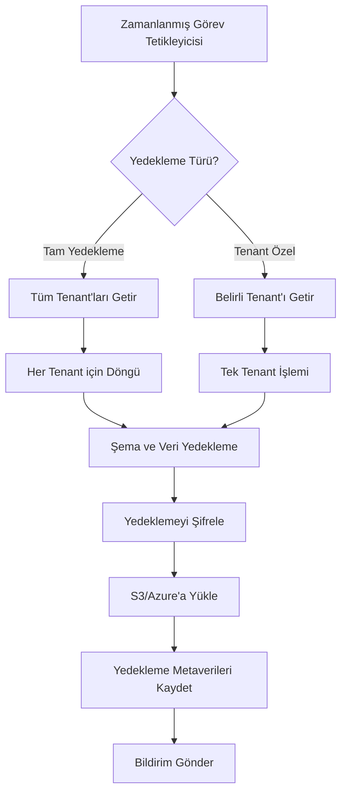

# Veritabanı Yedekleme Stratejisi

Bu doküman, Iqra Eğitim Portalı için veritabanı yedekleme stratejisini detaylı olarak açıklar. Strateji, çok kiracılı (multi-tenant) mimariye uygun şekilde tasarlanmıştır ve veri güvenliğini en üst düzeyde tutmayı amaçlar.

## 1. Genel Bakış

Iqra Eğitim Portalı, eğitim kurumlarının kritik verilerini barındıran bir SaaS uygulamasıdır. Verilerin güvenliği ve sürekliliği, platformun en temel gereksinimlerindendir. Bu doküman, hem genel sistem yedeklemeleri hem de tenant-bazlı yedekleme stratejilerimizi kapsar.

## 2. Yedekleme Tipleri ve Sıklıkları

Yedekleme stratejimiz, abonelik planlarına göre farklılaşan dört ana yedekleme tipini içerir:

| Yedekleme Türü             | Sıklık               | Saklama Süresi | Kapsam                         |
| -------------------------- | -------------------- | -------------- | ------------------------------ |
| Tam Yedekleme              | Günlük (gece)        | 30 gün         | Tüm tenant verileri ve şemalar |
| Artımlı Yedekleme          | Saatlik              | 7 gün          | Değişen veriler                |
| Anlık Yedekleme (Snapshot) | Haftalık             | 90 gün         | Tam sistem durumu              |
| Tenant Özel Yedekleme      | Manuel/İstek üzerine | 30 gün         | Tek bir tenant'ın verileri     |

### 2.1. Abonelik Planlarına Göre RPO (Kurtarma Noktası Hedefi)

Yedekleme sıklıkları ve RPO (Recovery Point Objective) abonelik planlarına göre şu şekilde ayarlanmıştır:

| Abonelik Planı | RPO     |
| -------------- | ------- |
| Free           | 24 saat |
| Standard       | 6 saat  |
| Premium        | 1 saat  |

## 3. Tenant Bazlı Yedekleme Yaklaşımı

Hybrid tenant izolasyon yaklaşımına uygun olarak, yedekleme stratejimiz de tenant'ları dikkate alır:

### 3.1. Şema Bazlı Tenant Yedeklemeleri

Her tenant için ayrı veritabanı şeması kullanıldığından, yedeklemeler de şema bazlı gerçekleştirilir:

```sql
-- Bir tenant için pg_dump komutu örneği
pg_dump -h ${DB_HOST} -U ${DB_USER} -d ${DB_NAME} -n tenant_${TENANT_ID} -f tenant_${TENANT_ID}_${DATE}.sql
```

### 3.2. Yedeklemeler için Tenant İzolasyonunun Korunması

Yedekleme sırasında tenant izolasyonu şu şekilde sağlanır:

- Her tenant şeması ayrı dosyalarda yedeklenir
- Yedeklemeler tenant ID'si ile adlandırılır
- Geri yükleme işlemleri sadece ilgili tenant şemasını etkiler
- Şifreleme anahtarları tenant bazında yönetilir

## 4. Yedekleme Güvenliği

### 4.1. Şifreleme

Tüm yedeklemeler AES-256 şifreleme ile korunur:

```typescript
// Şifreleme örneği
function encryptBackup(data: Buffer, encryptionKey: string): Buffer {
  const iv = crypto.randomBytes(16);
  const cipher = crypto.createCipheriv('aes-256-cbc', Buffer.from(encryptionKey, 'hex'), iv);
  const encrypted = Buffer.concat([cipher.update(data), cipher.final()]);
  return Buffer.concat([iv, encrypted]);
}
```

### 4.2. Yedekleme Doğrulama

Her yedekleme sonrası bütünlük kontrolü yapılır:

- SHA-256 hash değeri hesaplanır ve saklanır
- Geri yükleme öncesi hash doğrulaması yapılır
- Periyodik olarak rastgele yedeklemeler test ortamına geri yüklenerek test edilir

## 5. Yedekleme Depolama Stratejisi

### 5.1. Çoklu Lokasyon Depolama

Yedeklemeler aşağıdaki lokasyonlarda depolanır:

1. Birincil veritabanı sunucusu (geçici)
2. Yerel yedekleme sunucusu
3. Bulut depolama (AWS S3 / Azure Blob Storage)
4. Uzun süreli arşiv için soğuk depolama (90 günden eski yedeklemeler)

### 5.2. Yedekleme Rotasyonu

Yedekleme dosyaları aşağıdaki stratejiye göre yönetilir:

- Son 7 günün tam yedeklemeleri hızlı erişilebilir depolamada tutulur
- 7-30 gün arası yedeklemeler standart depolamada tutulur
- 30-90 gün arası yedeklemeler soğuk depolamada tutulur
- 90 günden eski yedeklemeler (Premium planlar için) arşiv depolamada tutulur

## 6. Otomatik Yedekleme Sistemi

### 6.1. Zamanlanmış Görevler

Yedekleme işlemleri aşağıdaki zamanlamaya göre çalışır:

```bash
# Tam yedekleme (günlük, gece yarısı)
0 0 * * * /usr/local/bin/node /app/src/scripts/backup/automated-backup.ts --type=full

# Artımlı yedekleme (saatlik)
0 * * * * /usr/local/bin/node /app/src/scripts/backup/automated-backup.ts --type=incremental

# Premium tenant'lar için özel yedekleme (saatlik)
30 * * * * /usr/local/bin/node /app/src/scripts/backup/automated-backup.ts --type=incremental --plan=premium
```

### 6.2. Yedekleme İş Akışı



## 7. Yedekten Geri Dönme (Restore) Prosedürleri

### 7.1. Tam Tenant Geri Yükleme

Bir tenant'ın tam olarak geri yüklenmesi için prosedür:

1. Yönetici panelinden geri yükleme talebi oluşturulur
2. Sistem uygun yedekleme dosyasını belirler
3. Tenant şeması yeniden oluşturulur (varsa önce drop edilir)
4. Yedek dosyası şifre çözülerek geri yüklenir
5. Veri bütünlüğü doğrulaması yapılır
6. Tenant servisleri yeniden başlatılır

### 7.2. Kısmi Geri Yükleme

Belirli tablolar veya veriler için kısmi geri yükleme prosedürü:

1. Yönetici geçici bir şemaya tam yedeği geri yükler
2. Geri yüklenecek veri SQL sorguları ile seçilir
3. Seçilen veriler hedef tenant şemasına aktarılır
4. Veri tutarlılığı kontrolleri yapılır

## 8. Test ve Doğrulama Prosedürleri

Yedekleme sisteminin düzenli olarak test edilmesi için:

- Haftalık: Rastgele bir tenant yedeklemesi test ortamına geri yüklenir
- Aylık: Tam sistem geri yükleme testi yapılır
- Üç Aylık: Felaket kurtarma tatbikatı gerçekleştirilir

## 9. İlgili Prosedürler ve Belgeler

- [Felaket Kurtarma Planı](disaster-recovery.md)
- [Veri İzolasyon Stratejisi](data-isolation.md)
- [Multi-tenant Mimari Stratejisi](multi-tenant-strategy.md)
