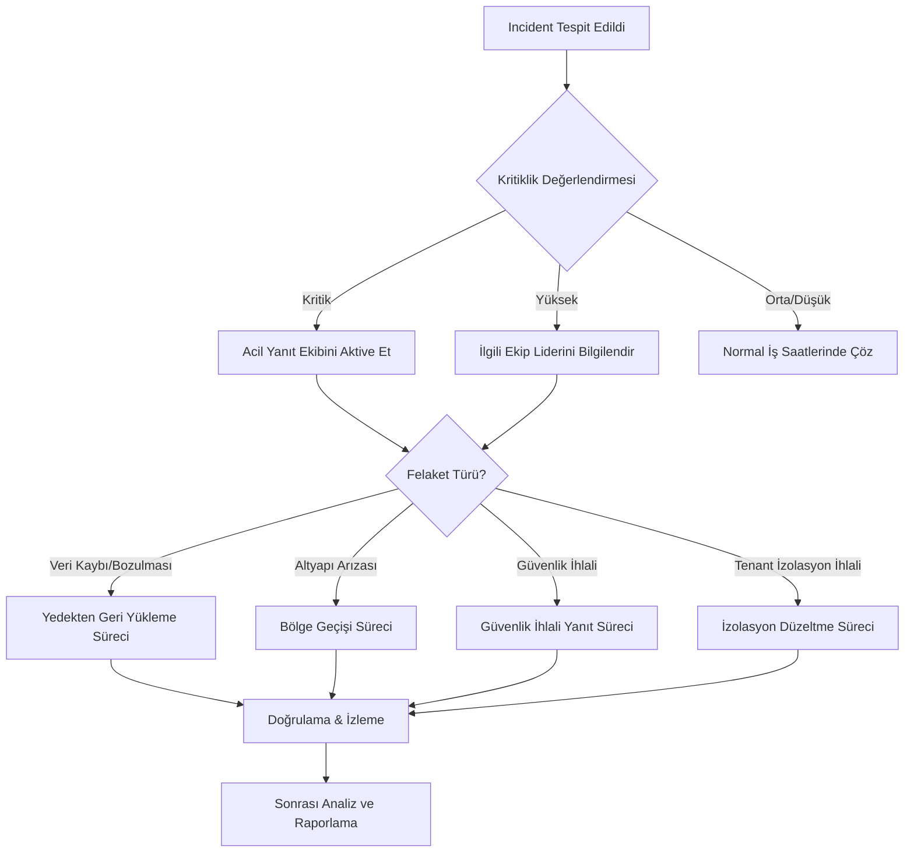

# Iqra Eğitim Portalı - Felaket Kurtarma Planı

## 1. Giriş

Bu belge, Iqra Eğitim Portalı'nın hizmet kesintilerini ve veri kayıplarını en aza indirmek için oluşturulan felaket kurtarma planını detaylandırmaktadır. Planın amacı, felaket durumunda sistemlerin hızlı ve güvenilir bir şekilde geri yüklenmesini sağlamaktır.

## 2. Kurtarma Hedefleri

### 2.1 Kurtarma Metrikleri

| Metrik | Hedef | Açıklama |
|--------|-------|----------|
| Kurtarma Noktası Hedefi (RPO) | 1 saat | Kabul edilebilir maksimum veri kaybı süresi |
| Kurtarma Süresi Hedefi (RTO) | 4 saat | Sistemin kabul edilebilir maksimum kesinti süresi |
| Maksimum Tolere Edilebilir Kesinti (MTD) | 8 saat | İş sürekliliğini etkileyen maksimum kesinti süresi |

### 2.2 Kritik Hizmet Seviyeleri

| Hizmet | Öncelik | RPO | RTO |
|--------|---------|-----|-----|
| Veritabanı | Kritik | 30 dakika | 2 saat |
| Kimlik Doğrulama | Kritik | 15 dakika | 1 saat |
| Web Uygulaması | Yüksek | 1 saat | 3 saat |
| Dosya Depolama | Orta | 2 saat | 4 saat |
| Analitik Sistemleri | Düşük | 12 saat | 24 saat |

## 3. Felaket Senaryoları ve Yanıt Planları

### 3.1 Veritabanı Arızası veya Veri Bozulması

#### Belirtiler:
- Uygulama veritabanı hatalarını raporluyor
- Beklenmeyen sonuçlar veya veri tutarsızlıkları
- Veritabanı sunucusu yanıt vermiyor

#### Yanıt Planı:
1. Incident yanıt ekibini bilgilendir
2. Veritabanı durumunu değerlendir
3. Etkilenen tenant'ları belirle
4. Son geçerli yedeklemeyi tanımla
5. Test ortamında geri yükleme doğrulama işlemi gerçekleştir
6. Üretim ortamında geri yükleme işlemi gerçekleştir
7. Veri bütünlüğü kontrolleri yap
8. Sistemlerin normal çalışmaya döndüğünü doğrula

### 3.2 Altyapı Arızası

#### Belirtiler:
- Sistem tamamen erişilemez durumda
- AWS/Azure hizmet kesintisi bildirimleri
- Sunucu izleme araçları kesinti raporluyor

#### Yanıt Planı:
1. Arızanın kapsamını ve nedenini değerlendir
2. Yedek bölgeye geçiş kararı ver
3. DNS yönlendirmesini aktif et
4. Yedek bölgedeki sistemleri ölçeklendir
5. Veri replikasyonunun doğruluğunu kontrol et
6. Kullanıcılara durum güncelleme bildirimi gönder
7. Sistemleri kademeli olarak aktif et
8. Tam fonksiyonellik testleri gerçekleştir

### 3.3 Güvenlik İhlali veya Siber Saldırı

#### Belirtiler:
- Anormal sistem davranışı veya performans
- Güvenlik izleme sistemlerinden uyarılar
- Yetkisiz veri erişimi bildirimleri
- Şüpheli kimlik doğrulama girişimleri

#### Yanıt Planı:
1. Etkilenen sistemleri izole et
2. Saldırının kapsamını belirle
3. Tenant verilerinin güvenliğini değerlendir
4. İhlal öncesi son temiz yedeklemeyi tanımla
5. Güvenlik yamaları uygula
6. Temiz bir ortama geri yükleme işlemini başlat
7. Etkilenen kullanıcıları bilgilendir
8. Yasal gerekliliklere göre bildirimleri yap (KVKK vb.)
9. Güvenlik denetimini tamamla

### 3.4 Tenant İzolasyon İhlali

#### Belirtiler:
- Bir tenant'ın başka bir tenant'ın verilerine erişebildiğine dair bildirimler
- RLS politikalarının başarısızlığı
- Veritabanı yapılandırma değişiklikleri sonrası karşılaşılan sorunlar

#### Yanıt Planı:
1. Etkilenen tenant'ları ve veri kapsamını belirle
2. Tüm tenant'lar için geçici olarak yazma erişimini devre dışı bırak
3. RLS politikalarını gözden geçir ve düzelt
4. DB şema izolasyon kontrollerini yap
5. Tenant sınırları dışında veri sızıntısı kontrolü yap
6. Etkilenen tenant'ları bilgilendir
7. Yasal gerekliliklere göre bildirimleri yap
8. Sistemi kademeli olarak yeniden aktif et

## 4. Kurtarma Süreci

### 4.1 Karar Ağacı

### 4.2 İletişim Planı

| Durum | İletişim Kanalı | Sorumlu | Hedef Kitle |
|-------|-----------------|---------|-------------|
| Kritik Kesinti | E-posta + SMS + Dashboard Bildirimi | Operasyon Müdürü | Tüm kullanıcılar + Yönetim |
| Planlı Bakım | E-posta + Dashboard Bildirimi | Sistem Yöneticisi | Etkilenen tenant'lar |
| Güvenlik İhlali | E-posta + SMS | Güvenlik Yöneticisi + Hukuk Ekibi | Etkilenen tenant'lar + Yasal Birimler |
| Kısmi Arıza | Dashboard Bildirimi | Destek Ekibi | Etkilenen tenant'lar |

## 5. Kurtarma Ekipleri ve Sorumluluklar

### 5.1 Felaket Kurtarma Koordinasyon Ekibi

| Rol | Sorumluluklar | Yedek |
|-----|---------------|-------|
| Felaket Kurtarma Koordinatörü | Tüm kurtarma sürecini koordine etme | Operasyon Müdürü |
| Teknik Operasyon Lideri | Teknik kurtarma süreçlerini yönetme | Kıdemli DevOps Mühendisi |
| İletişim Yöneticisi | İç ve dış iletişimi koordine etme | Pazarlama Direktörü |
| Güvenlik Sorumlusu | Güvenlik kontrollerini ve değerlendirmelerini yapma | BT Güvenlik Uzmanı |

### 5.2 Teknik Kurtarma Ekibi

| Rol | Sorumluluklar |
|-----|---------------|
| Veritabanı Uzmanı | Veritabanı geri yükleme ve bütünlük doğrulama |
| Sistem Mühendisi | Altyapı ve sunucu yönetimi |
| Ağ Uzmanı | Ağ bağlantıları ve güvenlik duvarı yapılandırması |
| Uygulama Geliştiricisi | Uygulama bütünlüğü ve fonksiyonellik testleri |

## 6. Test ve Bakım Planı

### 6.1 Test Programı

| Test Türü | Sıklık | Kapsam |
|-----------|--------|--------|
| Masaüstü Tatbikat | Aylık | Senaryo bazlı yanıt prosedürlerinin gözden geçirilmesi |
| Bileşen Geri Yükleme Testi | Üç Aylık | Belirli sistemlerin yedekten geri yüklenmesi |
| Tam Simülasyon | Yıllık | Tam felaket senaryosunun simülasyonu |
| Sürpriz Tatbikat | İki Yılda Bir | Önceden bildirimde bulunulmayan DR testi |

### 6.2 Plan Bakımı

- Plan, yılda en az iki kez gözden geçirilir ve güncellenir
- Her büyük sistem değişikliğinden sonra plan güncellenir
- Tüm test sonuçları belgelenir ve plan iyileştirmeleri için kullanılır

## 7. Ek Kaynaklar ve Araçlar

### 7.1 Kurtarma Araçları

- Supabase CLI
- AWS CLI / Azure CLI
- Terraform betikleri
- Özel yedekleme ve geri yükleme betikleri
- İzleme ve alarm sistemleri (Grafana, Prometheus)

### 7.2 Belge ve Şablonlar

- Incident Rapor Şablonu
- Durum Güncelleme Şablonu
- Geri Yükleme Kontrol Listesi
- Sonrası Analiz (Post-mortem) Şablonu

## 8. İlgili Dökümanlar

- [Yedekleme ve Geri Yükleme Stratejisi](backup-restore.md)
- [Veri Saklama Politikası](data-retention-policy.md)
- [İş Sürekliliği Planı](business-continuity-plan.md)
- [Güvenlik Olayı Yanıt Planı](security-incident-response-plan.md) 